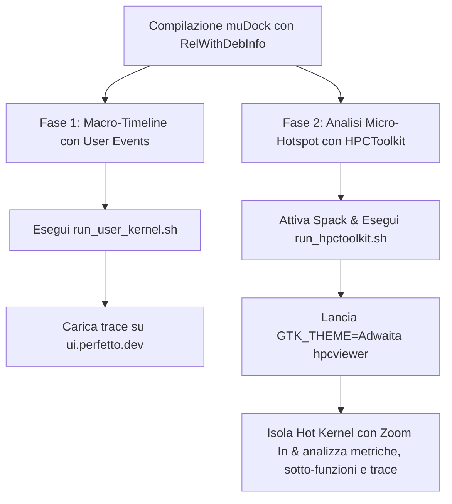

# 📊 Guida Completa al Profiling di muDock: User Events & HPCToolkit

Questa guida fornisce le istruzioni dettagliate passo-passo per profilare l'applicazione `muDock` su architetture AMD Zen 5. Imparerai come mappare le fasi macro dell'algoritmo usando gli **User Events (Perfetto)** e come eseguire un'analisi microscopica degli **Hot Kernel** e dei loro thread usando **HPCToolkit (hpcviewer)**.

---

## 🗺️ Mappa del Flusso di Profiling



---

## 🛠️ 1. Compilazione Preliminare di muDock

Per fare in modo che entrambi i tool leggano i simboli del codice e le macro di strumentazione, compila il binario abilitando le opzioni specifiche di profiling:

```bash
# 1. Spostati nella cartella di build di muDock
cd /home/olly/UNI/progetto_aca/muDock
mkdir -p build && cd build

# 2. Attiva l'ambiente Spack mudock_zen5
source /home/olly/spack/share/spack/setup-env.sh
spack env activate mudock_zen5

# 3. Configura CMake attivando USER_EVENTS e PAPI
$(spack location -i cmake@3.31.11)/bin/cmake .. \
  -DCMAKE_C_COMPILER=gcc-14 \
  -DCMAKE_CXX_COMPILER=g++-14 \
  -DCMAKE_BUILD_TYPE=RelWithDebInfo \
  -DMUDOCK_ENABLE_USER_EVENTS=ON \
  -DMUDOCK_ENABLE_PAPI=ON \
  -DMUDOCK_ENABLE_OMP=ON \
  -DMUDOCK_ENABLE_SYCL=OFF \
  -DCMAKE_PREFIX_PATH="$(spack location -i boost@1.90.0);$(spack location -i highway);$(spack location -i openbabel)"

# 4. Compila
make -j$(nproc)
```

---

## 🟢 2. Fase 1: Profiling degli User Events (Timeline su Perfetto)

Gli **User Events** consentono di misurare il tempo speso in regioni di codice definite manualmente (es. pipeline TBB, inizializzazione, calcolo energia) e di visualizzarle graficamente su una timeline interattiva.

### A. Esecuzione del Profiling

Spostati nella cartella degli script e lancia l'orchestratore associando i nomi logici agli ID degli eventi (da 1 a 10) inseriti nel codice sorgente:

```bash
cd /home/olly/UNI/progetto_aca/profile-scripts_Nedina_Popovschii/perf_stat_user_kernel
*:
   - **Lanes (Righe orizzontali)**: Ciascuna riga corrisponde a un thread. Vedrai i blocchi colorati con i nomi che hai specificato (es. `CalcEnergy`).
   - **Pipeline Overlap**: Verifica se i blocchi `CalcEnergy` e `GeomTransform` sono eseguiti in parallelo su thread diversi o se ci sono bolle di inattività (spazi vuoti) in cui la CPU non lavora.

---

## 🔵 3. Fase 2: Profiling Microscopic con HPCToolkit

HPCToolkit esegue un campionamento statistico non intrusivo dei contatori hardware della CPU (usando PAPI) per capire esattamente a livello di singola istruzione assembly o riga C++ dove avvengono le inefficienze.

### A. Esecuzione del Profiling (Preset Cache)
Lancia il profiling compilando le informazioni di struttura per la tua CPU AMD Zen 5:

```bash
cd /home/olly/UNI/progetto_aca/profile-scripts_Nedina_Popovschii/perf_stat_user_kernel

# Attiva Spack e carica HPCToolkit una volta per sessione
source /home/olly/spack/share/spack/setup-env.sh
spack env activate mudock_zen5
spack load hpctoolkit

# Esegui il profiling con il preset cache (cicli + miss cache L1/L2 e TLB)
./scripts/run_hpctoolkit.sh \
  --exe ../../muDock/build/application/muDock \
  --args "--protein ../../muDock/data/1fkb/1fkb_protein.pdb --ligand ../../muDock/data/1fkb/ligands100_12col.adtmol2 --use CPP:CPU:0-3 --search genetic --population 100 --generations 100" \
  --preset cache
```

Il database delle performance verrà generato in:
`./traces/hpctoolkit/database/`

### B. Avvio Corretto della GUI su Linux

Per evitare il bug dei pulsanti e delle icone completamente nere causato dal tema scuro del sistema operativo Linux (GTK), forza l'avvio con il tema chiaro `Adwaita`:

```bash
GTK_THEME=Adwaita hpcviewer ./traces/hpctoolkit/database/
```

---

## 🔍 4. Analisi Dettagliata in hpcviewer: Isolare gli Hot Kernel

Di seguito è descritta la procedura metodologica per analizzare il database in modo focalizzato:

### 📥 STEP A: Identificare gli Hot Kernel Principali

Quando apri il database, la vista predefinita è gerarchica a partire dal `main` (CCT). Per trovare subito i colli di bottiglia:

### 📥 STEP A: Identificare gli Hot Kernel

1. Spostati sul tab **Flat view** in alto a sinistra.
2. Clicca sulla colonna **`cycles: Sum (I)`** o **`PAPI_L2_DCM: Sum (I)`** per identificare le funzioni o i file più pesanti (es. `worker.hpp`, `adt_score.hpp`).
3. Prendi nota dei loro nomi (saranno i tuoi Hot Kernel).

### 🔍 STEP B: Isolare l'Hot Kernel (Funzione "Zoom In")
>
> [!IMPORTANT]
> Lo **Zoom In** non è disponibile nel tab **Flat view** (in quanto vista piatta senza struttura ad albero dinamica). Per poter isolare un kernel e le sue sotto-funzioni, devi utilizzare il tab **Top-down view** (CCT) o **Bottom-up view**.
>
1. Clicca sul tab **Top-down view** (o **Bottom-up view**) situato sopra la barra degli strumenti.
2. Naviga nell'albero e clicca per selezionare il tuo Hot Kernel (es. `adt_score.hpp` o `worker.hpp` in modo che la riga si evidenzi in blu).
3. Esegui lo zoom in uno dei seguenti modi:
   - Fai **click destro** sul nodo selezionato e scegli **Zoom In**.
   - Clicca sulla **6ª icona da sinistra** nella barra degli strumenti (la cartella con la freccetta verde che entra/punta a destra).
4. L'albero si aggiornerà mostrando solo il kernel selezionato come nuova radice dell'analisi. Per uscire dallo zoom, clicca sulla **7ª icona da sinistra** (la cartella con la freccetta verde che esce/punta a sinistra/alto) o fai click destro -> **Zoom Out**.
*(Nota: le lenti 🔍+ e 🔍- all'estrema destra servono solo a ridimensionare i caratteri del testo).*

### 🌳 STEP C: Esplorare le Sotto-Chiamate (Callees) e il Codice Sorgente

1. Clicca sulla **freccetta di espansione** a sinistra dell'Hot Kernel isolato.
2. L'albero si aprirà mostrando tutte le sotto-funzioni chiamate al suo interno, le macro, i loop interni e le righe di codice C++ più interne.
3. Seleziona una riga del codice espanso: il pannello di destra (**Source Code View**) caricherà automaticamente il rispettivo file sorgente (es. `adt_score_cpp.cpp`) evidenziando la riga selezionata.
4. Controlla i valori percentuali a inizio riga per individuare quale operazione matematica (es. calcoli con esponenti o cache miss) assorbe l'energia del kernel.

### 📊 STEP D: Grafico di Utilizzo dei Thread (Graph View)

Per controllare se il carico di lavoro all'interno dell'Hot Kernel è distribuito bene tra i thread fisici della CPU:

1. Seleziona l'Hot Kernel nella tabella.
2. Clicca sul pulsante **Graph View** (l'icona a forma di istogramma a barre) nella barra degli strumenti.
3. Verrà aperto un istogramma che mostra sull'asse X i singoli thread (TID) e sull'asse Y i cicli CPU spesi da ciascuno nel kernel:
   - **Altezza omogenea**: Ottimo bilanciamento del carico.
   - **Altezza irregolare**: Load imbalance. Un thread lavora molto più degli altri. Puoi ottimizzare la schedulazione OpenMP nel codice muDock.

### 👁️ STEP E: Analisi Temporale dell'Hot Kernel (Trace View)

Per osservare visivamente quando l'Hot Kernel è attivo nel tempo su ciascun thread:

1. Apri la **Trace View** cliccando sull'icona della timeline o sulla scheda corrispondente.
2. Trova il selettore **Depth** nella barra degli strumenti ed impostalo a un valore tra **5 e 12**.
3. Individua il colore associato al tuo Hot Kernel (es. Verde per `CalcEnergy`):
   - Se vedi bande continue di quel colore parallele su tutti i thread, significa che il kernel sta saturando in modo ottimale la CPU.
   - Se noti blocchi asincroni o spazi vuoti (grigi/bianchi), significa che i thread stanno aspettando una barriera di sincronizzazione o che c'è contesa sulla cache.
4. Fai **Zoom orizzontale** (disegnando un rettangolo col tasto sinistro del mouse) per allargare la timeline in una singola fase e studiare l'alternanza tra il calcolo dell'energia e la mutazione genetica.

---

## 📑 5. Cheat Sheet dei Comandi Rapidi

| Operazione | Comando |
| :--- | :--- |
| **Setup PAPI** | `source ./scripts/setup_papi.sh` |
| **Run User Events** | `./scripts/run_user_kernel.sh --exe ../../muDock/build/application/muDock --args "..." --event-1 "Name"` |
| **Run HPCToolkit** | `./scripts/run_hpctoolkit.sh --exe ../../muDock/build/application/muDock --args "..." --preset cache` |
| **Avvio hpcviewer** | `GTK_THEME=Adwaita hpcviewer ./traces/hpctoolkit/database/` |

---

## 📈 6. Creare Regole (Metriche Derivate) ed Esportare in CSV

Nella barra degli strumenti situata direttamente sopra la tabella (subito sopra l'intestazione "Scope"), `hpcviewer` offre due funzionalità fondamentali per l'analisi avanzata e l'estrazione dei dati:

### A. Creare Regole e Formule (Icona Tabella con il Più Verde `+`)

È la **6ª icona da sinistra** (rappresentata da una griglia/foglio con un piccolo `+` verde in basso a destra). Consente di definire regole e formule matematiche per calcolare nuove metriche a partire da quelle hardware esistenti (es. calcolare l'IPC o il tasso di cache miss).

1. Fai clic sul pulsante **Tabella con il più verde `+`**. Si aprirà la finestra **"Add Derived Metric"**.
2. **Name**: Inserisci il nome della nuova regola (es. `L2_Miss_Rate` o `IPC`).
3. **Formula**: Specifica la formula matematica. Le colonne esistenti sono identificate dal simbolo del dollaro seguìto dal loro indice numerico (es. `$0`, `$1`, `$2` ecc.).
   - *Esempio IPC*: Se `$1` rappresenta `PAPI_TOT_INS` e `$0` rappresenta `cycles`, la formula sarà:
     `$1 / $0`
   - *Esempio L2 Cache Miss Rate*: Se `$2` rappresenta `PAPI_L2_DCM` e `$0` rappresenta `cycles`, puoi calcolare il tasso inserendo:
     `$2 / $0`
4. **Format**: Imposta lo stile di formattazione (es. `%.4f` per avere 4 cifre decimali, o `%.2f%%` per visualizzare una percentuale).
5. Premi **OK**: una nuova colonna verrà aggiunta alla tabella principale con i risultati calcolati in tempo reale su ciascuna riga e sotto-chiamata.

### B. Esportare in CSV (Icona Vassoio con Freccia Verde in Alto)

È la **7ª icona da sinistra** (rappresentata da un vassoio/hard-disk con una freccia verde che punta verso l'alto). Consente di esportare l'intera tabella visualizzata in un formato testuale universale per Excel o script Python.

1. Clicca sull'icona **Vassoio con la freccia rivolta verso l'alto**.
2. Scegli la cartella di destinazione e assegna un nome al file (es. `report_metrics.csv`).
3. Il file CSV conterrà l'intera struttura gerarchica (nomi delle funzioni, file sorgente, righe di codice, metriche misurate e metriche derivate create tramite le regole).
