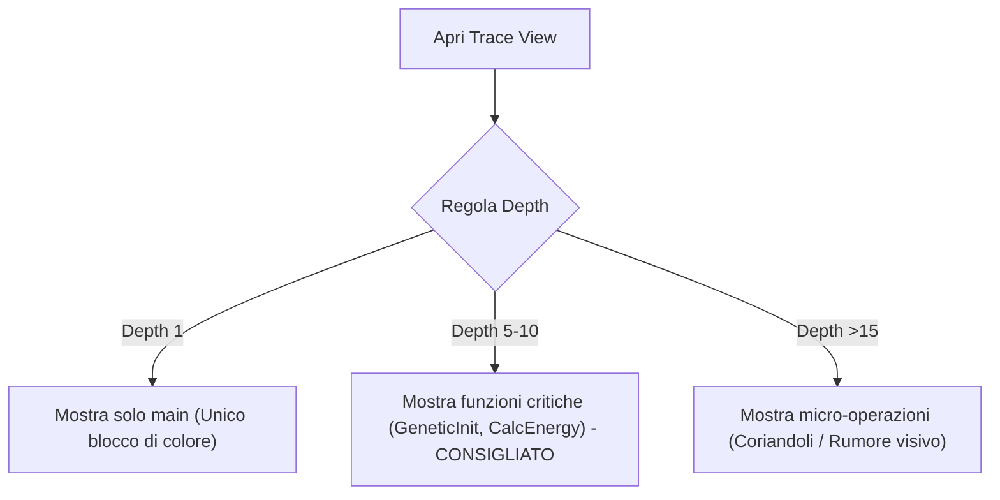

# 📖 Guida Avanzata all'Uso di hpcviewer per muDock

Questa guida spiega in dettaglio come navigare nell'interfaccia grafica **hpcviewer**, con particolare attenzione alla **leggibilità dei grafici, della timeline (Trace View) e delle metriche** raccolte tramite lo script [run_hpctoolkit.sh](file:///home/olly/UNI/progetto_aca/profile-scripts_Nedina_Popovschii/perf_stat_user_kernel/scripts/run_hpctoolkit.sh).

---

## 🎯 1. Cosa stiamo analizzando?
Lo script esegue `muDock` raccogliendo:
* **`cycles` (Cicli di Clock)**: Identifica dove la CPU spende più tempo (hotspot computazionali).
* **`PAPI_L2_DCM` (L2 Cache Miss)**: Identifica quando la CPU è ferma ad attendere dati dalla memoria RAM/L3 (hotspot di memoria).

---

## 👁️ 2. Guida alla leggibilità della Trace View (La Timeline dei Thread)

La **Trace View** (accessibile cliccando sul tab o sull'icona della timeline in alto) mostra l'esecuzione del programma nel tempo. 
* L'asse **X** rappresenta il **tempo** di esecuzione (scorre da sinistra a destra).
* L'asse **Y** rappresenta i **thread** (ogni riga orizzontale è un thread di esecuzione).
* I **colori** rappresentano le diverse funzioni del codice in esecuzione.

> [!WARNING]
> **Perché all'inizio sembra illeggibile o confuso?**
> Di default, la timeline mostra l'intera esecuzione del programma condensata in una sola schermata e con una profondità di chiamata (Depth) predefinita. Questo può dare un effetto "muro di pixel colorati" o "coriandoli". Segui i passi seguenti per renderla pulita e leggibile.

### A. Zoom e Navigazione Temporale (Asse X)
Per ingrandire e studiare fasi specifiche dell'algoritmo (es. la fase centrale del Genetic Algorithm):
1. **Zoom via Selezione (Consigliato)**: Clicca col tasto sinistro del mouse sulla timeline e trascina per disegnare un rettangolo attorno all'area di interesse. Al rilascio del mouse, la vista si focalizzerà solo su quell'intervallo temporale.
2. **Zoom con la Rotella del Mouse**: Posiziona il cursore sul punto che ti interessa ed esegui lo scroll (rotella in avanti per zoomare, indietro per allontanare).
3. **Pulsanti della Barra degli Strumenti**:
   - 🔍➕ (**Zoom In**): Ingrandisce orizzontalmente.
   - 🔍➖ (**Zoom Out**): Rimpicciolisce orizzontalmente.
   - 🔍↔️ (**Zoom to Fit / Reset**): Ripristina la visualizzazione dell'intera esecuzione.

### B. Regolare la Profondità dello Stack di Chiamata (Call Stack Depth)
Questo è il fattore più importante per eliminare la confusione visiva:
* **Profondità Troppo Bassa (es. 1-3)**: Vedrai una timeline dominata da un unico colore solido (che rappresenta `main` o il thread orchestratore). Non fornisce informazioni utili sulle singole funzioni.
* **Profondità Troppo Alta (es. >15)**: Vedrai pixel frammentati e caotici (rappresentano micro-chiamate a funzioni standard come `std::vector::operator[]`).
* **Come regolarla**: Trova il selettore **Depth** (spesso indicato con frecce su/giù o un cursore numerico nella barra superiore o nel pannello laterale del Call Path). 
  - Imposta una profondità compresa tra **5 e 10**. A questo livello, i blocchi di colore corrisponderanno a funzioni macro e riconoscibili di muDock (es. `GeneticIterate`, `CalcEnergy`, `GeomTransform`).

### C. Associare i Colori alle Funzioni del Codice
1. **Clicca su un pixel colorato** in un thread della timeline.
2. Guarda il pannello **Call Path** (di solito posizionato a destra o in basso).
3. Il pannello evidenzierà l'esatta sequenza di chiamate (Call Stack) che quel thread stava eseguendo in quell'istante di tempo, associando ogni função al proprio colore.
4. Facendo doppio clic sulla riga della funzione nel Call Path, `hpcviewer` aprirà il rispettivo file sorgente C++ posizionando il cursore sulla riga esatta.

---

## 📊 3. Rendere leggibili i Grafici delle Metriche (Distribuzione del Carico)

Se desideri visualizzare la distribuzione delle metriche (es. quanta CPU consuma ciascun thread hardware), puoi sfruttare la **Graph View**:

1. Nella tabella inferiore del pannello delle metriche (Flat o CCT), seleziona la funzione o il loop che vuoi analizzare.
2. Clicca sull'icona a forma di **Grafico a Barre (Graph View)** nella barra degli strumenti di hpcviewer.
3. Verrà mostrato un grafico (istogramma) che mostra sull'asse X i singoli thread (TID) e sull'asse Y il valore della metrica selezionata (es. numero di `cycles` o `PAPI_L2_DCM`).

> [!TIP]
> **Come interpretare il grafico dei thread:**
> * **Grafico piatto (Altezza uniforme)**: Il carico computazionale è bilanciato in modo eccellente tra tutti i thread OpenMP.
> * **Grafico a sbalzi (Alcuni thread molto alti, altri a zero)**: C'è un problema di **load imbalance**. Alcuni thread finiscono subito il lavoro e rimangono inattivi, mentre altri continuano a elaborare. Puoi risolvere questo problema modificando la schedulazione OpenMP nel codice di muDock da `schedule(static)` a `schedule(dynamic)` o `schedule(guided)`.

---

## 🔍 4. Flusso di Analisi Consigliato per muDock

Per analizzare muDock in modo strutturato ed evitare di perdersi nei dati, segui questa scaletta:

| Step | Vista | Azione | Obiettivo |
| :--- | :--- | :--- | :--- |
| **1** | **Flat View** | Ordina la colonna `cycles` in modo decrescente. | Identificare immediatamente la funzione C++ più pesante del programma (es. `CalcEnergy`). |
| **2** | **CCT (Calling Context Tree)** | Espandi la funzione hotspot individuata nello Step 1. | Capire da quale modulo o thread viene chiamata quella funzione. |
| **3** | **Source Code View** | Seleziona la funzione hotspot per aprire il file `.cpp` integrato. | Trovare la singola riga di codice all'interno del loop di calcolo che causa il collo di bottiglia. |
| **4** | **Metric Compare** | Confronta `% cycles` e `% PAPI_L2_DCM` sulla stessa riga. | Capire se ottimizzare la matematica (Compute Bound) o la memoria/cache (Memory Bound). |
| **5** | **Trace View** | Zoomma sulla fase di computazione parallela (regola Depth = 8). | Controllare visivamente se ci sono fasi in cui i thread sono inattivi (barra bianca/grigia o assenza di colore). |

---

## 🔝 5. Visualizzare gli Hot Kernel come Nodi Principali (Flat View & Zoom In)

Se vuoi visualizzare gli **hot kernel** (le funzioni più pesanti) in primo piano come nodi principali e, solo cliccandoci sopra, esplorare le sotto-funzioni (callees) e le loro metriche/tracce, puoi farlo in `hpcviewer` combinando due funzionalità:

### Metodo A: Utilizzo della Flat View (Identificazione Hotspot)
La **Flat View** aggrega i tempi di ciascuna funzione a prescindere da chi l'abbia chiamata, posizionando le funzioni in una lista piatta.
1. Seleziona il tab **Flat view** in alto a sinistra.
2. Ordina la tabella cliccando sulla colonna **`cycles`** (o `PAPI_L2_DCM`) in ordine decrescente.
3. Prendi nota dei tuoi hotspot o file principali (es. `adt_score.hpp`, `worker.hpp`).

### Metodo B: La funzione "Zoom In" (Isolare un Kernel)
> [!IMPORTANT]
> Lo **Zoom In** non è utilizzabile nel tab *Flat view* perché è una lista piatta priva di relazioni gerarchiche dinamiche. Per poter fare lo zoom e isolare un kernel e le sue sotto-chiamate, devi posizionarti sul tab **Top-down view** (CCT) o **Bottom-up view**.
>
1. Spostati sul tab **Top-down view** (o **Bottom-up view**).
2. Seleziona il kernel o il file di interesse (es. clicca su `adt_score.hpp` o `worker.hpp` in modo che diventi blu).
3. Nella barra degli strumenti situata **direttamente sopra la tabella** (sotto i tab delle viste e subito sopra la colonna "Scope"), individua nella parte centrale le due icone a forma di **cartella/classe con una freccia verde**:
   - **Icona Zoom In (la 6ª da sinistra)**: Rappresenta una cartella con una **freccetta verde che entra (punta verso destra)**. Cliccandola (o facendo **click destro -> Zoom In**), isoli il nodo selezionato rendendolo la nuova radice dell'analisi.
   - **Icona Zoom Out (la 7ª da sinistra)**: Rappresenta una cartella con una **freccetta verde che esce (punta verso sinistra/alto)**. Cliccandola (o facendo **click destro -> Zoom Out**), annulli lo zoom.
*(Nota: le lenti 🔍+ e 🔍- all'estrema destra servono per ridimensionare il font dei caratteri).*

---

## 📈 6. Creare Regole (Metriche Derivate) ed Esportare in CSV

Nella barra degli strumenti situata direttamente sopra la tabella (subito sopra l'intestazione "Scope"), `hpcviewer` mette a disposizione due pulsanti fondamentali:

### A. Creare Regole e Formule (Icona Tabella con il Più Verde `+`)
È la **6ª icona da sinistra** (rappresentata da una griglia/foglio con un piccolo `+` verde in basso a destra). Consente di definire regole e formule per calcolare nuove metriche (es. IPC o cache miss rate).
1. Fai clic sul pulsante **Tabella con il più verde `+`**. Si aprirà la finestra **"Add Derived Metric"**.
2. **Name**: Inserisci il nome della nuova regola (es. `IPC`).
3. **Formula**: Specifica la formula matematica usando il simbolo del dollaro seguito dal numero di indice della colonna (es. `$1 / $0` per dividere la colonna 1 per la colonna 0).
4. **Format**: Imposta lo stile di formattazione (es. `%.4f` o `%.2f%%`).
5. Premi **OK**: una nuova colonna con i risultati della regola verrà aggiunta alla tabella principale.

### B. Esportare in CSV (Icona Vassoio con Freccia Verde in Alto)
È la **7ª icona da sinistra** (rappresentata da un vassoio/hard-disk con una freccia verde rivolta verso l'alto). Consente di salvare i dati analizzati in un file CSV.
1. Clicca sull'icona **Vassoio con la freccia rivolta verso l'alto**.
2. Scegli la cartella e assegna un nome al file (es. `report.csv`).
3. Il file conterrà l'intera struttura gerarchica (nomi delle funzioni, file sorgente, righe di codice e metriche misurate/derivate) esportata in formato CSV.

