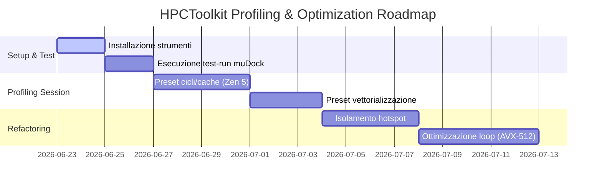

# 🗺️ Roadmap per il Profiling con HPCToolkit — muDock

Questo documento definisce il piano di integrazione, le procedure di installazione e il workflow operativo per utilizzare **HPCToolkit** come strumento principale di campionamento statistico delle performance su `muDock`.

---

## 📌 1. Perché HPCToolkit?

Mentre **PAPI** strumenta esplicitamente il codice (aggiungendo overhead se richiamato troppo frequentemente), **HPCToolkit** lavora per **campionamento (sampling)** statistico:
- **Overhead minimo (< 2%)**: Adatto per esecuzioni lunghe.
- **Correlazione al codice C++**: Mappa le metriche hardware (stalli, cache miss) direttamente alle righe del codice sorgente (grazie ai simboli di debug DWARF).
- **Nessuna modifica del codice**: Funziona su binari precompilati in modalità `RelWithDebInfo`.

---

## 🛠️ 2. Installazione di HPCToolkit e hpcviewer

### A. Installazione di HPCToolkit (tramite Spack)
HPCToolkit richiede diverse dipendenze complesse per decodificare il binario e i simboli. Spack è lo strumento consigliato per compilarlo ed installarlo.

Esegui i seguenti comandi per installare HPCToolkit all'interno del tuo ambiente Spack:
```bash
# Attiva l'ambiente Spack
source /home/olly/spack/share/spack/setup-env.sh
spack env activate mudock_zen5

# Installa hpctoolkit con supporto PAPI
spack install hpctoolkit +papi

# Verifica l'avvenuta installazione
spack load hpctoolkit
hpcrun --version
```

### B. Installazione di hpcviewer (Interfaccia Grafica)
`hpcviewer` è l'interfaccia Java per esplorare le metriche per thread e per riga di codice. Può essere scaricato come binario precompilato.

1. **Prerequisito**: Assicurati di avere Java Runtime Environment (JRE) installato:
   ```bash
   sudo apt install default-jre
   ```
2. **Download di hpcviewer**:
   ```bash
    # Scarica l'ultima versione di hpcviewer da GitLab
    wget https://gitlab.com/hpctoolkit/hpcviewer/-/releases/permalink/latest/downloads/hpcviewer-linux.gtk.x86_64.tar.gz
    
    # Estrai l'archivio
    tar -xvf hpcviewer-linux.gtk.x86_64.tar.gz
    
    # Esegui hpcviewer direttamente dalla cartella estratta:
    ./hpcviewer/hpcviewer
    ```

---

## ⚙️ 3. Workflow e Automazione con `run_hpctoolkit.sh`

Abbiamo creato lo script di automazione [run_hpctoolkit.sh](file:///home/olly/UNI/progetto_aca/profile-scripts_Nedina_Popovschii/perf_stat_user_kernel/scripts/run_hpctoolkit.sh) che gestisce le tre fasi del profiling:

1. **`hpcrun`**: Esegue l'applicazione ed effettua il campionamento dei contatori (es. `cycles`, `PAPI_L2_DCM`).
2. **`hpcstruct`**: Analizza la struttura di loop ed istruzioni del binario `muDock`.
3. **`hpcprof`**: Combina i dati di `hpcrun` e `hpcstruct` con il codice sorgente per creare la gerarchia visualizzabile.

### Come Eseguire lo Script
Posizionati nella directory di profiling ed esegui:

```bash
cd /home/olly/UNI/progetto_aca/profile-scripts_Nedina_Popovschii/perf_stat_user_kernel

# Esegui il profiling con il preset standard (cycles e PAPI_L2_DCM)
./scripts/run_hpctoolkit.sh \
  --exe ../../muDock/build/application/muDock \
  --args "--protein ../../muDock/data/1fkb/1fkb_protein.pdb --ligand ../../muDock/data/1fkb/ligands100_12col.adtmol2 --use CPP:CPU:0-3 --search genetic --population 100 --generations 100"
```

### Visualizzazione dei Risultati
A fine esecuzione, apri il database generato con `hpcviewer`:
```bash
hpcviewer ./traces/hpctoolkit/database/
```

---

## 📅 4. Roadmap di Analisi e Ottimizzazione

Ecco le fasi proposte per integrare l'analisi di HPCToolkit nel flusso di lavoro del progetto:



### 🎯 Metriche Consigliate per il Profiling su AMD Zen 5:
- **`cycles`**: Mostra la concentrazione di tempo di calcolo.
- **`PAPI_L2_DCM`**: Evidenzia i cache miss in L2 per isolare i problemi di contesa di memoria.
- **`PAPI_BR_MSP`**: Mostra se ci sono fallimenti nella predizione dei branch condizionali (es. nei branch imprevedibili delle funzioni di energia).
- **`PAPI_VEC_INS`**: Aiuta a quantificare le istruzioni vettoriali rispetto a quelle scalari.
