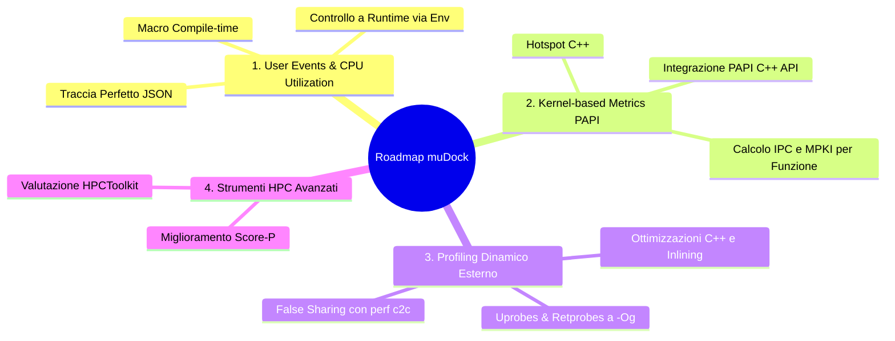

COncentrazione sugli user-event , possiamo andare a visualizzare e modificare quello che vogliamo , l'idea è utilizzare delle sonde per andare a vedere quando si sta esenguendo codice che non è user , vogliamo andare a avere una maggior utilization possibile

metrice di interesse solo per il kernel (funzioni kern) usare papi_avail (tutti i flag disponibili)

Passaggi da fare :

L'idea è concentrarci con gli user event , abbiamo il permesso di utilizzare e modificare il codice sorgente :
La mia idea è molto smeplice , definisco delle macro che vengono attivate in fase di compilazione (massimo 10) , una volta compilato e makato il codice durante la run dello script bisognerà specificare quale macro usare e che nome dargli , in modo tale che poi si avrà una traccia visibile su perfetto degli user event con tutti i vari tempi di esecuzione della traccia e potendo capire quanto è al livello di utilization user.

Fatto ciò

Dopo di che la cartella perf_stat va convertita da application base a kernel base , e con kernel intendiamo le hot spot
Due possibilita , sempre lavorare con le macro , semplicemnte avremo che le macro attivano e disattivano i contatori hw della hot function , oppure tramite base_script.sh andare a pescare le top n funzioni e mapparle per verificare tutti i paramtrei del caso.

Una cosa importante , cerchiamo di sruttare papi_avail e tutti i flag disponibili  , andando anche a impementare altri non disponibili ma che consideriamo importanti.

Inifne verichiamo meglio l'impplementazione di score-p cercando di andare a capire cosa sia successo o non e come sfruttarla per migliorare tutto , sfruttiamo anche hpc_toolkit e vediamo se è utile

idea (si potrebbe se ci sta tempo a impleemntare <!--
SPDX-FileCopyrightText: Contributors to the HPCToolkit Project

SPDX-License-Identifier: CC-BY-4.0
-->

# HPCToolkit User Manual

HPCToolkit is an integrated suite of tools for measurement and analysis of program performance on computers ranging from multicore desktop systems to the world's largest GPU-accelerated supercomputers.
HPCToolkit can measure a program's work, resource consumption, and inefficiency on both CPUs and GPUs ([Adhianto et al. 2010](https://dx.doi.org/10.1002/cpe.1553); [Zhou et al. 2020](https://doi.org/10.1016/j.parco.2021.102837); [Adhianto et al. 2024](https://doi.org/10.1177/10943420241277839)).
HPCToolkit correlates such metrics with the program's source code, works with multilingual, fully optimized binaries, has very low measurement overhead, and scales to large parallel systems.
HPCToolkit's measurements provide support for analyzing a program execution cost, inefficiency, and scaling characteristics both within and across nodes of a parallel system.

```{toctree}
---
numbered:
maxdepth: 2
---
users/index.md
```)


# 🗺️ Analisi e Sviluppo della Roadmap di Profiling per muDock

Questo documento espande e struttura in punti di azione l'analisi di fattibilità e l'architettura per l'implementazione del sistema di tracciamento e profiling di `muDock` per il corso di **Architettura dei Calcolatori Avanzata**.

---

## 🎯 Obiettivi Chiave della Nuova Roadmap

A partire dalle idee espresse nel file [road_map.md](file:///home/olly/UNI/progetto_aca/road_map.md) e tenendo conto dello stato attuale dei test riportato in [status.md](file:///home/olly/UNI/progetto_aca/profile-scripts_Nedina_Popovschii/utilitis/status.md), la roadmap si articola su **quattro pilastri principali**:



---

## 📌 Punto 1: Tracciamento degli User Events & Utilization Rate

L'obiettivo è marcare le regioni di codice C++ scritte direttamente dall'utente (es. l'algoritmo genetico o le iterazioni principali di docking) per distinguerle dal codice di sistema (I/O, inizializzazione, allocazione di memoria, overhead di OpenMP/TBB).

### 🛠️ Strategia di Implementazione

1. **Definizione delle Macro Compile-time (Massimo 10):**
   Creare un header dedicato `mudock/include/mudock/user_events.hpp` per gestire l'abilitazione condizionale delle macro in fase di compilazione. Se una macro non è definita, il compilatore la rimuoverà del tutto (overhead pari a zero).

   ```cpp
   // mudock/include/mudock/user_events.hpp
   #pragma once
   
   #ifdef MUDOCK_ENABLE_USER_EVENTS
     #define MUDOCK_USER_EVENT_START(id, default_name) \
         mudock::UserEventTracer::getInstance().startEvent(id, default_name)
     #define MUDOCK_USER_EVENT_STOP(id) \
         mudock::UserEventTracer::getInstance().stopEvent(id)
   #else
     #define MUDOCK_USER_EVENT_START(id, default_name)
     #define MUDOCK_USER_EVENT_STOP(id)
   #endif
   ```

2. **Controllo a Runtime (Nome e Attivazione):**
   Per evitare di dover ricompilare ogni volta che si vuole cambiare nome o disabilitare una traccia, l'oggetto singleton `UserEventTracer` interrogherà le variabili d'ambiente a runtime (es. all'inizializzazione del programma):
   - `MUDOCK_USER_EVENT_1_NAME="GeneticAlgorithm"`
   - `MUDOCK_USER_EVENT_2_NAME="EnergyEvaluation"`

   Se l'environment variable per l'evento $i$-esimo non è impostata, l'evento viene ignorato (overhead minimo di un controllo booleano a runtime).

3. **Struttura Dati Thread-Safe:**
   Poiché `muDock` è multithreading (OpenMP, TBB), `UserEventTracer` userà dei buffer `thread_local std::vector<UserEventRecord>` per evitare contese di lock durante le fasi calde di computazione.

   ```cpp
   struct UserEventRecord {
       int id;
       std::string name;
       int64_t ts_start_us;
       int64_t duration_us;
       pid_t tid;
   };
   ```

4. **Esportazione in Formato Perfetto JSON:**
   All'uscita del programma (es. nel distruttore o tramite una chiamata in `main.cpp`), tutti i buffer thread-local verranno fusi e scritti in un file compatibile con Perfetto (`trace_user_events.json`) usando il formato **Chrome Trace Event (JSON)**:

   ```json
   {
     "traceEvents": [
       {"ph": "X", "name": "GeneticAlgorithm", "cat": "user", "ts": 100234, "dur": 5400, "pid": 120, "tid": 121, "args": {"id": 1}},
       ...
     ],
     "displayTimeUnit": "us"
   }
   ```

5. **Calcolo della CPU Utilization per Codice User:**
   Lo script di esecuzione calcolerà l'indice di efficienza:
   $$\text{User Utilization \%} = \frac{\sum \text{Durata User Events}}{\text{Tempo di Esecuzione Totale}} \times 100$$
   I "gaps" vuoti nella timeline di Perfetto evidenzieranno istantaneamente le fasi inefficienti.

---

## 📌 Punto 2: Transizione di `perf_stat` da "Application-wide" a "Kernel-wide" (Hotspot)

Attualmente, `perf_stat` misura le metriche hardware (IPC, cache miss, page faults) per l'intero binario. Tuttavia, l'inizializzazione del parsing di molecole giganti (PDB/MOL2) altera drammaticamente i dati. Vogliamo isolare le misurazioni esclusivamente sulle funzioni critiche ("hotspot" o "kernel" computazionali, es. `calc_energy`).

Abbiamo due strade possibili.

### Opzione A: API di PAPI (Performance Application Programming Interface) dentro il codice
>
> [!NOTE]
> Questa è la via più rigorosa dal punto di vista HPC. Il supporto PAPI è già presente nell'ambiente Spack locale (`papi@7.2.0`).

1. **Strumentazione con Macro PAPI:**
   Inserire macro dedicate all'inizio e alla fine degli hotspot in `muDock`:

   ```cpp
   #ifdef MUDOCK_USE_PAPI
     #define MUDOCK_PAPI_START(hotspot_name) mudock::PapiTracer::start(hotspot_name)
     #define MUDOCK_PAPI_STOP(hotspot_name)  mudock::PapiTracer::stop(hotspot_name)
   #else
     #define MUDOCK_PAPI_START(hotspot_name)
     #define MUDOCK_PAPI_STOP(hotspot_name)
   #endif
   ```

2. **Inizializzazione Dinamica dei Contatori:**
   Lo script `cpu_metrics.sh` o `full_pipeline.sh` esporta le metriche scelte usando i flag standard forniti da `papi_avail` (es. `export MUDOCK_PAPI_EVENTS="PAPI_TOT_CYC,PAPI_TOT_INS,PAPI_L3_TCM"`).
   Il codice C++ leggerà questa variabile all'avvio e configurerà dinamicamente l'EventSet di PAPI.

3. **Supporto Multithreading in PAPI:**
   Fondamentale inizializzare PAPI in modalità thread-safe:

   ```cpp
   PAPI_thread_init(pthread_self);
   ```

   Ogni thread leggerà i propri contatori hardware esclusivi durante l'esecuzione del kernel.

### Opzione B: Script-based Hotspot Profiling (Uprobes/Retprobes)
>
> [!IMPORTANT]
> Non richiede la modifica del codice con librerie esterne, ma richiede una gestione attenta delle ottimizzazioni del compilatore.

1. **Risoluzione dell'Inlining:**
   Come emerso in `status.md`, a `-O2`/`-O3` le uprobes falliscono perché le funzioni calde sono inlineate.
   - **Soluzione:** Compilare temporaneamente il modulo target con flag `-Og` (ottimizzato per debugging, preserva i frame delle funzioni) oppure applicare l'attributo C++ `__attribute__((noinline))` esclusivamente sulle funzioni hotspot in esame.
2. **Dynamic Tracing via Script (`base_script.sh` / `low_level_probe.sh`):**
   Agganciare i probe all'ingresso e all'uscita delle funzioni calde:

   ```bash
   sudo perf probe -x ./build/application/muDock calc_energy
   sudo perf probe -x ./build/application/muDock calc_energy%return
   ```

   Raccogliere i dati PMU filtrati per gli eventi di probe, limitando la raccolta solo a quando la CPU sta effettivamente eseguendo quell'intervallo.

---

## 📌 Punto 3: Sfruttamento di `papi_avail` e Metriche Derivate Personalizzate

Per estrarre il massimo valore scientifico dalle metriche hardware, non dobbiamo limitarci ai contatori grezzi, ma implementare metriche derivate specifiche a livello di hotspot.

| Metrica di Interesse | Evento PAPI standard | Calcolo derivato / Significato |
| :--- | :--- | :--- |
| **Exclusive IPC** | `PAPI_TOT_CYC`, `PAPI_TOT_INS` | $\text{IPC} = \frac{\text{PAPI\_TOT\_INS}}{\text{PAPI\_TOT\_CYC}}$. Efficienza della pipeline solo sull'hotspot. |
| **L3 cache MPKI** | `PAPI_TOT_INS`, `PAPI_L3_TCM` | $\text{MPKI} = \frac{\text{PAPI\_L3\_TCM}}{\text{PAPI\_TOT\_INS}} \times 1000$. Frequenza degli accessi in RAM lenta. |
| **Branch Misprediction Rate** | `PAPI_BR_CNP`, `PAPI_BR_MSP` | $\% = \frac{\text{PAPI\_BR\_MSP}}{\text{PAPI\_BR\_CNP}} \times 100$. Efficienza della predizione nei loop condizionali. |
| **Vectorization Intensity** | `PAPI_VEC_DP`, `PAPI_VEC_SP` | Valuta l'utilizzo delle istruzioni SIMD (AVX/SSE) su Zen 5. |

### Integrazione nel flusso di analisi

Nel caso di **PAPI integrato**, queste metriche verranno calcolate direttamente nel codice C++ al termine dell'hotspot e stampate in formato strutturato.
Nel caso di **Score-P**, configureremo la variabile d'ambiente `SCOREP_METRIC_PAPI` per includere queste specifiche metriche in modo che siano visibili in Cube GUI.

---

## 📌 Punto 4: Consolidamento di Score-P e Valutazione di HPCToolkit

### 1. Consolidamento di Score-P (OMPT e User Instrumentation)

I test precedenti hanno mostrato che la strumentazione automatica del compilatore genera troppo overhead o fallisce per via di `gcc-plugin`. La soluzione ottimale individuata in `sessione3.md` (uso di `scorep~gcc-plugin` + `--nocompiler`) va estesa.

- **Pianificazione:**
    1. Utilizzare il runtime OpenMP nativo via **OMPT (OpenMP Tools Interface)** per tracciare i task e i thread OpenMP in tempo reale senza toccare il compilatore.
    2. Utilizzare le **macro di Score-P User Instrumentation** nel codice sorgente di `muDock`. Questo ci permette di marcare regioni specifiche in modo programmatico:

       ```cpp
       #include <scorep/SCOREP_User.h>
       ...
       SCOREP_USER_REGION_BEGIN(handle, "docking_core", SCOREP_USER_REGION_TYPE_COMMON)
       // codice hotspot
       SCOREP_USER_REGION_END(handle)
       ```

    3. Compilare muDock linkando le librerie di Score-P solo se specificato in CMake (es. `-DMUDOCK_USE_SCOREP=ON`).

### 2. Valutazione di HPCToolkit (Alternativa a Basso Overhead)

A differenza di Score-P (che si basa sulla strumentazione), **HPCToolkit** funziona per **campionamento statistico (sampling)** basato su intervalli di tempo o contatori hardware.

> [!TIP]
> **Perché HPCToolkit è estremamente promettente per muDock:**
>
> - **Overhead ridottissimo (1-2%):** Adatto per run di produzione lunghi.
> - **Nessuna modifica al codice:** Funziona direttamente sul binario compilato con info di debug (`RelWithDebInfo`).
> - **Correlazione riga per riga:** Associa i cicli e le cache miss direttamente alle righe del codice sorgente C++ tramite l'analisi dei file DWARF.

- **Workflow proposto per HPCToolkit:**
    1. Compilare il binario `muDock` standard con simboli di debug.
    2. Misurare con `hpcrun`:

       ```bash
       hpcrun -e cycles -e PAPI_L3_TCM -t ./build/application/muDock <args>
       ```

    3. Generare la struttura del programma con `hpcstruct`:

       ```bash
       hpcstruct ./build/application/muDock
       ```

    4. Correlare i dati con `hpcprof`:

       ```bash
       hpcprof -S muDock.hpcstruct -I ./mudock/src hpctoolkit-muDock-measurements
       ```

    5. Visualizzare la gerarchia in `hpcviewer` per analizzare dove si concentrano le inefficienze a livello di loop.

---

## 📅 Piano d'Azione Implementativo (Fasi proposte)

Per realizzare ordinatamente i punti sopra descritti senza compromettere la stabilità del codice, si suggerisce la seguente suddivisione:

### Fase A: Strumentazione User Events (Punto 1)

- [ ] Creazione dell'header `user_events.hpp` in `muDock`.
- [ ] Integrazione delle macro `MUDOCK_USER_EVENT` nelle 3-4 aree più importanti di `muDock` (es. `run_tbb_pipeline`, `evaluate`, `mutate`).
- [ ] Scrittura della classe `UserEventTracer` per raccogliere i dati thread-local e fare il flush del JSON Chrome-compatible.
- [ ] Aggiornamento di `full_pipeline.sh` per attivare le variabili d'ambiente dei nomi delle macro a runtime.

### Fase B: Isolamento Hotspot via PAPI (Punto 2 & 3)

- [ ] Introduzione del supporto PAPI C++ API condizionale in `muDock` via CMake (`-DMUDOCK_USE_PAPI=ON`).
- [ ] Strumentazione delle hotspot functions principali con le macro di attivazione/disattivazione dei contatori.
- [ ] Estensione degli script di profiling per interrogare `papi_avail` e configurare gli eventi hardware.

### Fase C: Integrazione Strumenti HPC (Punto 4)

- [ ] Valutazione di HPCToolkit tramite run di test su `muDock` compilato con simboli.
- [ ] Raffinamento dei filtri Score-P e integrazione con la modalità OMPT.
