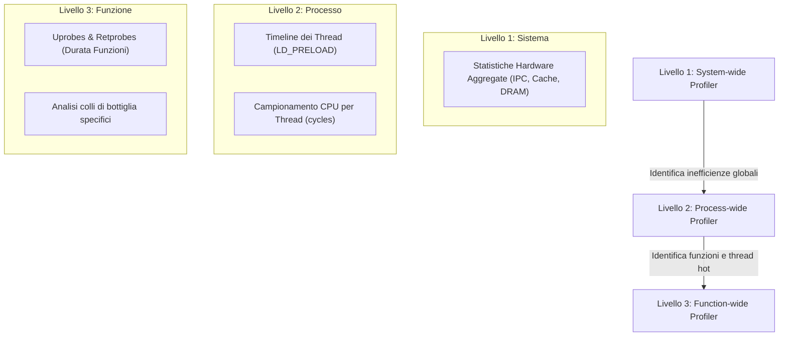

# Roadmap Profiling muDock: Approccio Top-Down (System, Process, Function)

Questo documento definisce la roadmap architetturale per lo sviluppo dell'infrastruttura di profiling di `muDock` per l'esame di **Architettura dei Calcolatori Avanzata**.
L'approccio scelto è di tipo **Top-Down a 3 livelli di astrazione**, garantendo un'analisi non invasiva completa (dal comportamento del sistema operativo fino alle singole istruzioni calde).

---

## 🗺️ Architettura di Profiling a 3 Livelli



---

## 🛠️ Dettaglio della Roadmap di Sviluppo

### 📊 Livello 1: System-wide Profiler (`system_profiler.sh`)
**Scopo:** Analizzare l'impatto della simulazione sull'intero sistema (CPU, gerarchia di cache, memoria DRAM e OS jitter). Risponde alla domanda: *«Il processore sta lavorando in modo efficiente o è in attesa dei dati?»*

*   **Metriche da raccogliere:**
    *   **IPC (Instructions Per Cycle):** Efficienza di esecuzione delle istruzioni su Zen 5.
    *   **Cache Misses globali:** Percentuale di fallimento in L1, L2 ed L3 (LLC).
    *   **Page Faults:** Overhead introdotto dalla gestione della memoria virtuale.
    *   **Memory Bandwidth:** Banda occupata sul canale DRAM (GB/s).
*   **Strumenti utilizzati:**
    *   `perf stat` (con contatori PMU per cache, istruzioni, cicli e page faults).
    *   Contatori hardware uncore per la banda di memoria.
*   **Output generato:** Report testuale pulito con KPI di efficienza hardware (es. *"IPC medio: 1.8 (Buono) - LLC Misses: 2% (Basso) - DRAM Bandwidth: 12.4 GB/s"*).

---

### ⚙️ Livello 2: Process-wide Profiler (`process_profiler.sh`)
*Nota: Corrisponde all'integrazione di `base_converter.sh` e `high_level_so.cpp`.*  
**Scopo:** Isolare il singolo processo `muDock` ed analizzare il comportamento macro dei suoi thread OpenMP. Risponde alla domanda: *«Come viene distribuito il lavoro tra i thread e qual è il livello di parallelismo reale?»*

*   **Analisi dei Thread:**
    *   Timeline di creazione, schedulazione e terminazione dei thread POSIX/OpenMP.
    *   Rilevamento del parallelismo istantaneo attivo.
*   **Campionamento CPU:**
    *   Risoluzione dei simboli DWARF in `RelWithDebInfo` per mappare l'attività su ogni thread lane.
*   **Strumenti utilizzati:**
    *   `LD_PRELOAD=libhigh_level.so` (intercettazione `pthread_create`).
    *   `perf record -g --call-graph dwarf` (evento `cycles`).
*   **Output generato:**
    *   `trace_high_level.json` (visualizzabile in Perfetto UI: ciclo di vita dei thread e grafico del parallelismo).
    *   `trace_perf.json` (visualizzabile in Perfetto UI: campionamento delle funzioni per ogni thread).

---

### 🔍 Livello 3: Function-wide Profiler (`function_profiler.sh`)
*Nota: Corrisponde all'estensione di `low_level_probe.sh`.*  
**Scopo:** "Aprire" il processo ed effettuare un'autopsia ad altissima precisione sulle funzioni o sui thread più pesanti identificati al Livello 2. Risponde alla domanda: *«Quanto dura esattamente ogni singola invocazione della funzione critica e dove risiede la contesa?»*

*   **Analisi Mirata:**
    *   Tracciamento mirato ed esclusivo delle sole Top-N funzioni calde.
    *   Misurazione della durata effettiva (in microsecondi) di ogni singola chiamata della funzione.
*   **Metodologia avanzata (da fare):**
    *   Utilizzo di **retprobes** (`perf probe %return`) per calcolare la differenza temporale tra ingresso ed uscita delle funzioni.
    *   Analisi del **False Sharing** (`perf c2c`) per verificare se i thread si intralciano a vicenda modificando la stessa cache line.
*   **Strumenti utilizzati:**
    *   `perf probe` (uprobes dinamiche all'ingresso ed all'uscita delle funzioni).
    *   `perf record -e probe:events` (eseguito con `sudo` + `chown` automatico).
    *   `perf c2c` (Cache-to-Cache profiling per il False Sharing).
*   **Output generato:**
    *   `trace_low_level.json` (visualizzabile in Perfetto UI: timeline dettagliata con le slice reali delle sole funzioni tracciate).

---

## 📅 Piano d'Azione (Fasi di Consegna)

```
[FASE 1: Consolidamento]
 ├── Validazione finale del Livello 2 (LD_PRELOAD e cycles conversion) ────> COMPLETATA ✅
 └── Validazione finale del Livello 3 (Uprobes su prepare() con sudo) ──────> COMPLETATA ✅

[FASE 2: Sviluppo Livello 1 (System-wide)]
 └── Scrittura di 'system_profiler.sh' che lancia 'perf stat' con contatori dedicati a cache/DRAM.

[FASE 3: Sviluppo Retprobes (Function-wide)]
 └── Modifica di 'low_level_probe.sh' per aggiungere le return probes (%return) e generare slice di durata reali.

[FASE 4: Master Orchestrator]
 └── Creazione di 'full_pipeline.sh' per avviare System, Process e Function profiler in sequenza.
```

---
*Documento di pianificazione per il Progetto ACA — Università*
